

<!-- PROJECT LOGO -->
 

  

<h3 align="center">Todo List Manager</h3>

  

    GUI desktop application that allows a user to manage todo lists.
     
  

  

    https://www.linkedin.com/in/furie/
  

<!-- ABOUT THE PROJECT -->
## About The Project

 
<a href="https://github.com/billyfurie/furie-app1-impl">
    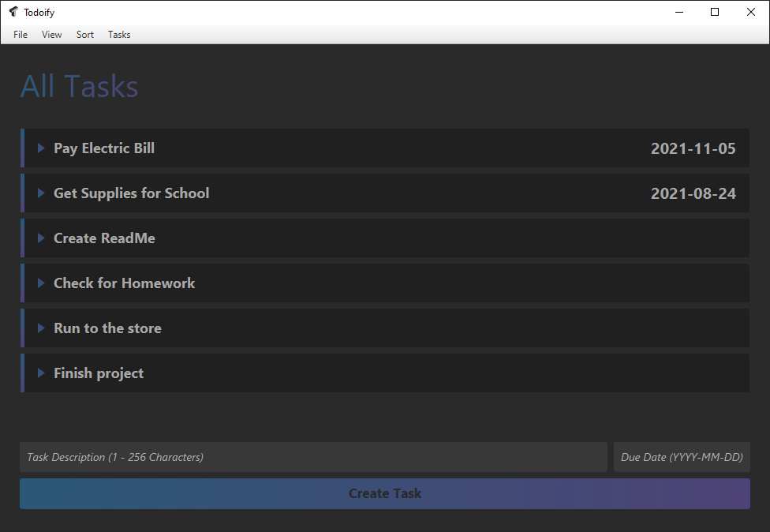
</a>
 
Project worked on in Fall 2021 for my Object Oriented Programming Class

(<a href="#top">back to top</a>)

### Built With

* [JavaFX](https://openjfx.io/)
* [Scene Builder](https://gluonhq.com/products/scene-builder/)

(<a href="#top">back to top</a>)

## User Guide

<!-- USAGE EXAMPLES -->

  
Table of Contents

  <ul>
    <li><a href="#Creating-a-Todo-List">Creating a Todo List</a></li>
    <li><a href="#Adding-Tasks-to-a-Todo-List">Adding Tasks to a Todo List</a></li>
    <li><a href="#Removing-Tasks-from-a-Todo-List">Removing Tasks from a Todo List</a></li>
    <li><a href="#Selecting--Deselecting-Tasks">Selecting / Deselecting Task(s)</a></li>
    <li><a href="#Editing-a-Tasks-Information">Editing a Tasks Information</a></li>
    <li><a href="#Marking-a-Task-Complete--Incomplete">Marking a Task Complete / Incomplete</a></li>
    <li><a href="#collapsing--opening-tasks">Collapsing / Opening Task(s)</a></li>
    <li><a href="#Change-Task-Display-Mode">Change Task Display Mode</a></li>
    <li><a href="#Sorting-Todo-List-by-Due-Date">Sorting Todo List by Due Date</a></li>
    <li><a href="#Saving-a-Todo-List">Saving a Todo List</a></li>
    <li><a href="#Loading-a-Todo-List">Loading a Todo List</a></li>
  </ul>

### Creating a Todo List
#### By default, when you launch the application, you will begin with a blank todo list.
If you want to manually create a new todo list, it can be found in the header menu. File -> Create New List.
<!-- PICTURE HERE  -->
 

### Adding Tasks to a Todo List
- A task **must** have a description of 1-456 characters.
- A task **may** have a due date, if desired. The due date **must** be in the format YYYY-MM-DD.

A task can be created by entering the description (and due date, if applicable) in the Task Editor at the bottom section of the program.
- The user can either click the *Create Task* button with their mouse, or press *Enter* while in one of the text fields.

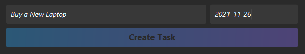

### Removing Tasks from a Todo List

#### Removing Task using Task Manager
- Click on the task to show the task manager panel (<a href="#Task-Manager-Panel">picture</a>).
- Click **Delete Task** on the far right to remove the task.

#### Removing Task(s) using Select Feature
- Right click on the task(s) you would like to remove (Or use Tasks -> Select All).
- In the header menu, go to Tasks -> Remove Selected.

(<a href="#User-Guide">back to table of contents</a>)

### Selecting / Deselecting Task(s)
#### Right Click on a Task to Toggle Select
#### Select / Deselect All Tasks
- Go to the header menu
- Tasks -> Select All Tasks
- Tasks -> Deselect All Tasks

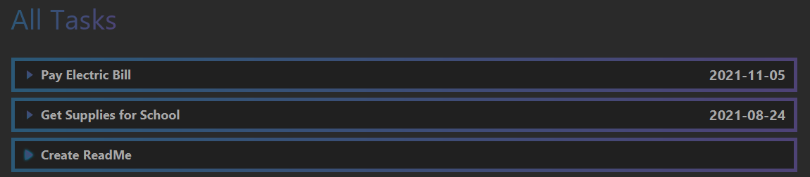
There is a highlighted border around task when it is selected.

### Editing a Tasks Information

#### Editing Description
- Click on the task to show the task manager panel (<a href="#Task-Manager-Panel">picture</a>).
- Click on **Edit Description**.
- Enter the new description for the task.

#### Editing Due Date
- Click on the task to show the task manager panel (<a href="#Task-Manager-Panel">picture</a>).
- Click on **Edit Due Date**.
- Enter the new due date for the task.
   

### Marking a Task Complete / Incomplete

#### Marking Task Complete using Task Manager
- Click on the task to show the task manager panel (<a href="#Task-Manager-Panel">picture</a>).
- Click **Mark Complete** or **Mark Incomplete** button on the far left to mark complete / incomplete.

#### Marking Task(s) Complete / Incomplete using Select Feature
- Right click on the task(s) you would like to mark complete / incomplete.
- To mark complete, in the header menu, go to Tasks -> Mark Selected as Complete.
- To mark incomplete, in the header menu, go to Tasks -> Mark Selected as Incomplete.

(<a href="#User-Guide">back to table of contents</a>)

 

### Collapsing / Opening Task(s)
- This is done by clicking on a task
- Can also be done for **all** tasks at once by using the header menu
  - Tasks -> Collapse All Tasks
  - Tasks -> Open All Tasks
     

### Change Task Display Mode
- To view **all** tasks in the list, in the header menu, go to View -> Show All Tasks.
- To view **completed** tasks in the list, in the header menu, go to View -> Show Completed Tasks.
- To view **uncompleted** tasks in the list, in the header menu, go to View -> Show Uncompleted Tasks.

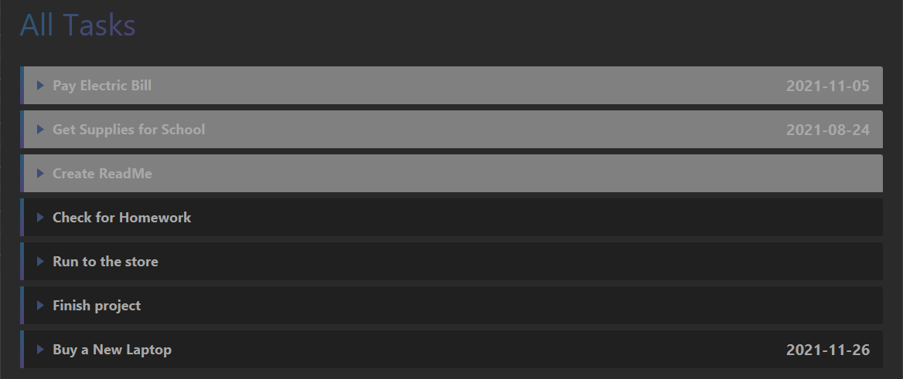
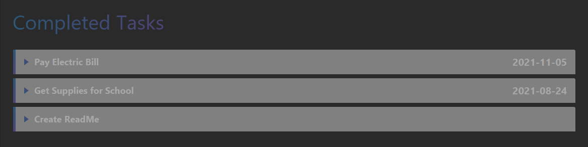
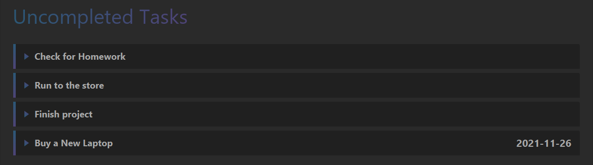

 

### Sorting Todo List by Due Date
- To sort the dates in **ascending** order, in the header menu, go to Sort -> Sort by Date Ascending.
- To sort the dates in **descending** order, in the header menu, go to Sort -> Sort by Date Descending.
   

### Saving a Todo List
- In the header menu, go to File -> Save List.
- Find a place on your computer to save the file.

Save List                  |  File Chooser
:-------------------------:|:-------------------------:
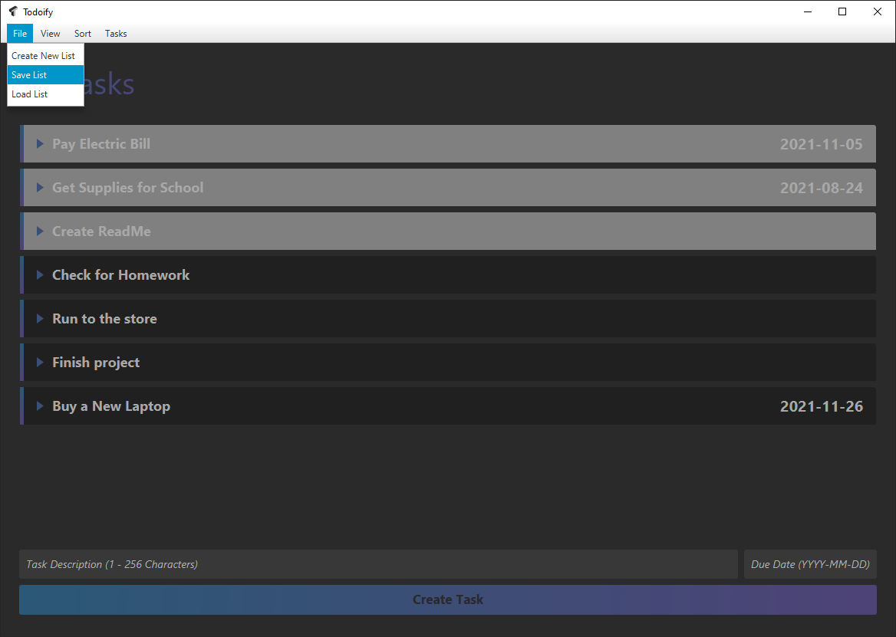         |  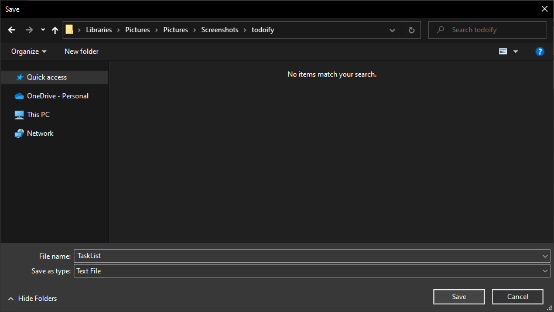

(<a href="#User-Guide">back to table of contents</a>)

 

### Loading a Todo List
- In the header menu, go to File -> Load List.
- Find a todo list that you have previously saved before.
- Load the file.

Load List                  |  File Chooser
:-------------------------:|:-------------------------:
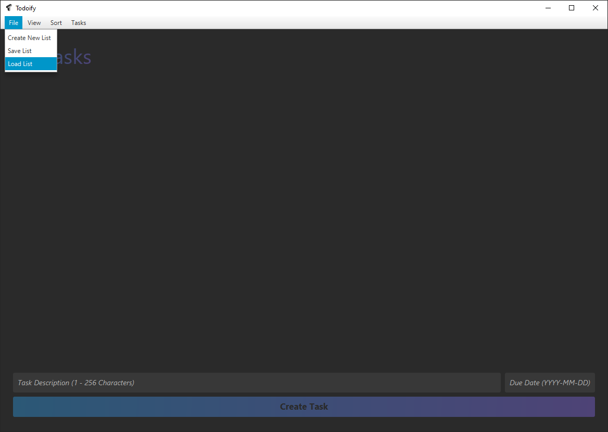         |  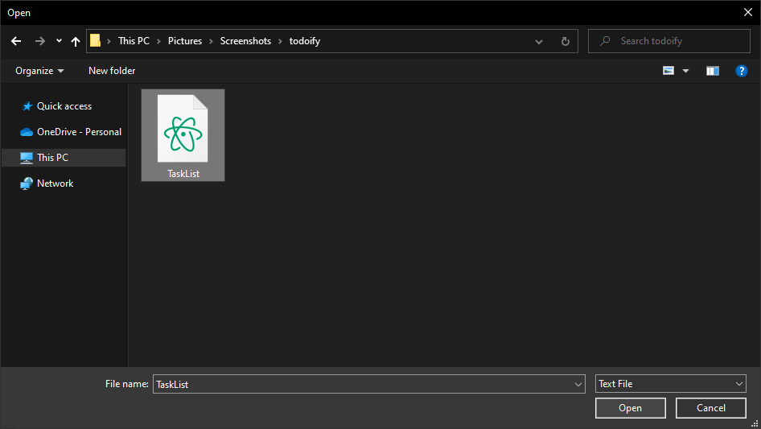

 
 

(<a href="#top">back to top</a>)

### Task Manager Panel
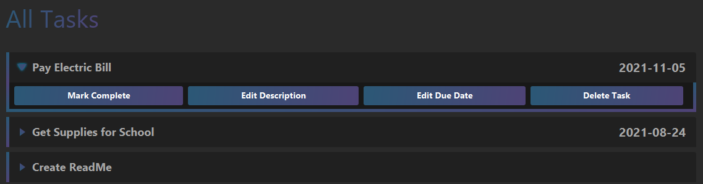

<!-- ACKNOWLEDGMENTS -->
## Acknowledgments

* Dr. Hollander
* TA Who Grades This

(<a href="#top">back to top</a>)

